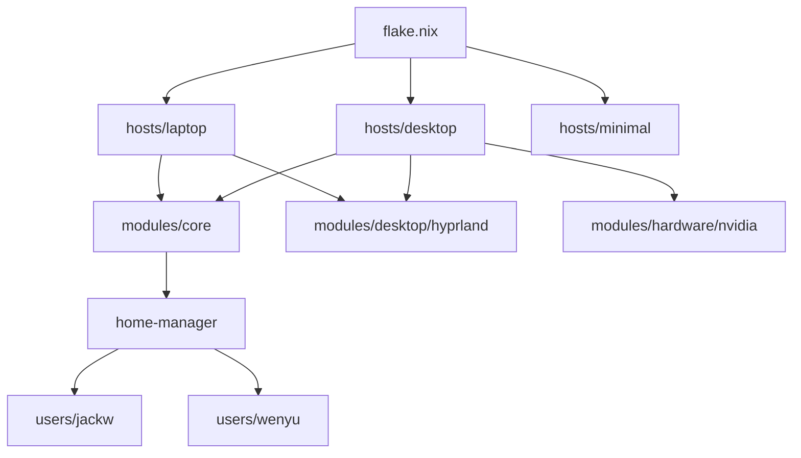

# NixOS Configuration Structure

This document explains the organization of the NixOS configuration in `/etc/nixos`.

## Directory Layout

```
/etc/nixos/
├── flake.nix              # Entry point - defines all system configurations
├── flake.lock             # Locked dependency versions
│
├── hosts/                 # Machine-specific configurations
│   ├── desktop/           # Desktop workstation
│   │   ├── default.nix    # Desktop-specific settings, imports modules
│   │   └── hardware-configuration.nix  # Auto-generated hardware config
│   ├── laptop/            # MacBook with T2 chip
│   │   ├── default.nix    # Laptop-specific settings, T2 fixes
│   │   └── hardware-configuration.nix
│   └── minimal/           # TTY-only fallback configuration
│       └── default.nix
│
├── modules/               # Reusable NixOS modules
│   ├── core/
│   │   └── default.nix    # Shared settings: locale, networking, users, fonts
│   ├── desktop/
│   │   ├── hyprland.nix   # Hyprland compositor + Wayland packages
│   │   ├── greetd.nix     # Login manager
│   │   ├── cosmic.nix     # COSMIC desktop option
│   │   └── kde.nix        # KDE Plasma option (unused)
│   └── hardware/
│       └── nvidia.nix     # NVIDIA drivers + CUDA configuration
│
└── users/                 # Home Manager user configurations
    ├── jackw/
    │   ├── default.nix    # User entry point, imports all modules
    │   ├── shell.nix      # Zsh, starship, zoxide, direnv
    │   ├── hyprland.nix   # Hyprland keybinds, rofi, mako, hyprlock
    │   ├── waybar.nix     # Status bar configuration
    │   ├── spacemacs.nix  # Emacs configuration
    │   ├── secrets.nix    # sops-nix secrets management
    │   ├── programs/
    │   │   ├── foot.nix    # Terminal emulator
    │   │   └── default.nix  # Git, Zen browser settings
    │   ├── packages/
    │   │   ├── cli.nix         # CLI tools (ripgrep, fzf, eza, etc.)
    │   │   ├── development.nix # Dev tools (neovim, PyCharm, Python)
    │   │   └── applications.nix # GUI apps (Discord, Obsidian, etc.)
    │   └── files/
    │       └── .spacemacs  # Spacemacs configuration file
    │
    └── wenyu/
        ├── default.nix    # User entry point
        ├── shell.nix      # Zsh config (same features as jackw)
        ├── foot.nix       # Terminal config
        ├── hyprland.nix   # Hyprland settings
        └── programs/
            └── default.nix  # Git, Zen browser
```

## Key Concepts

### Flake Structure

The `flake.nix` defines 3 system configurations:
- **nixos** → Desktop with NVIDIA GPU
- **laptop** → MacBook with T2 chip
- **nixos-minimal** → TTY fallback (no GUI)

### Module Hierarchy



### What Goes Where

| Category | Location | Example |
|----------|----------|---------|
| System-wide settings | `modules/core/` | Timezone, locale, system users |
| Desktop environment | `modules/desktop/` | Hyprland, greetd, Wayland |
| Hardware drivers | `modules/hardware/` | NVIDIA, GPU settings |
| Machine-specific | `hosts/<machine>/` | Hostname, kernel params |
| User packages | `users/<user>/packages/` | CLI tools, apps |
| User dotfiles | `users/<user>/*.nix` | Shell, terminal config |

## Common Tasks

### Adding a new package for jackw
Edit `users/jackw/packages/cli.nix`, `development.nix`, or `applications.nix`

### Adding a system-wide package
Edit `modules/core/default.nix` → `environment.systemPackages`

### Adding a new user
1. Create `users/<username>/` with `default.nix`
2. Add to `flake.nix` under `home-manager.users.<username>`
3. Add system user in `modules/core/default.nix`

### Switching configurations
```bash
rebuild              # Switch current machine
rebuild-desktop      # Explicitly use desktop config
rebuild-laptop       # Explicitly use laptop config
```
